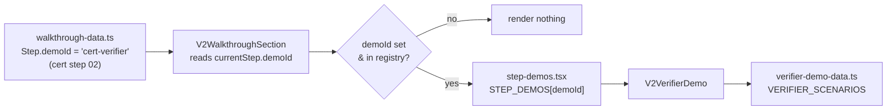
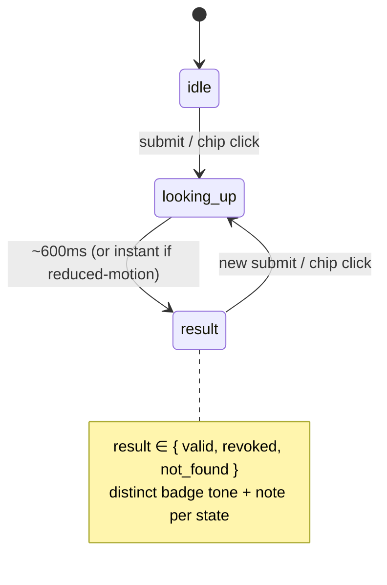

# feat: Landing walkthrough mini-demos — cert verifier + extensible demo seam

**Repo:** `landing-page-and-blog` (this repo) · **Branch:** `feat/enterprise-landing-page`
**Origin:** Ready-to-file ISSUE drafted 2026-06-18 in the Andamio orchestration area (`2026-06-18-002-landing-walkthrough-mini-demos-ISSUE.md`). All file paths below are repo-relative to `landing-page-and-blog`.

---

## Summary

Mount interactive mini-demos inside the existing archetype walkthrough (`V2WalkthroughSection`). Each archetype already tells a 4-step prose story; one step per story makes a claim that a 20-second interaction can make executable, so the visitor *sees* the claim instead of reading it.

This plan ships **one signature demo** — the cert-body Public Credential Verifier, mounted on cert step 02 "The shift" — plus the **extensible `demoId` seam** that lets the partner and cohort demos drop in later as data + one component. The seam is the real deliverable; the verifier proves it. Partner/cohort demos and real-data wiring are deferred to follow-up.

---

## Problem Frame

`src/ui/landing/V2Landing/V2WalkthroughSection.tsx` is the only place on the landing page that segments the visitor by who they are: an interactive, archetype-tailored, 4-step narrative with state + localStorage. The narrative copy in `src/ui/landing/V2Landing/walkthrough-data.ts` is complete for all three archetypes. The gap is that the most persuasive moments are still words. Cert step 02 claims *"Verification becomes public read, not a support ticket"* — a verifier card turns that sentence into something the visitor operates.

Doing this as a one-off card would waste the opportunity. The valuable artifact is a registry seam (`demoId` on a step → component) so the next two demos are mechanical follow-ons, not fresh builds.

**Design-idiom note (important):** Both origin docs predate the de-slop work committed this session (commit `31361c89`), which removed offset shadows and decorative monospace across the V2 landing. Their "offset shadows / tight radii" instruction is **stale**. This plan builds the demo in the current post-de-slop idiom (see KTD-2). JetBrains Mono remains imported and `--font-mono` is intact, so the verifier may use `font-mono` for on-chain data fields — the one honest use of monospace.

---

## Requirements

Traced to the origin ISSUE's acceptance criteria (AC) and locked decisions (D):

- **R1** (AC1) — Selecting the cert archetype and navigating to step 02 shows a working verifier card.
- **R2** (AC2) — All three scenarios (valid / revoked / not found) render distinct, correct result states.
- **R3** (AC3) — A `demoId` field + `STEP_DEMOS` registry are in place; adding a future demo is data + one component, with no change to the render seam.
- **R4** (AC4) — `prefers-reduced-motion` respected (lookup animation skipped); mobile layout verified.
- **R5** (AC5) — No new dependencies; passes existing lint and `next build`.
- **R6** (D, "Build now") — Interaction shape: pre-filled sample ID + Valid/Revoked/Not-found chips → ~600ms scripted lookup → result card (issuer, on-chain anchor block/tx, truncated holder address, status badge) → punchline. Includes the "old way" contrast toggle (confirmed in scope; built on-brand, see KTD-6).
- **R7** (D, "extensible seam") — `walkthrough-data.ts` stays declarative; no JSX in the data file.
- **R8** (compound-engineering) — Capture the reusable pattern so partner/cohort demos are mechanical.

---

## Key Technical Decisions

- **KTD-1 — Registry lives in its own module, not inline in the section.** `STEP_DEMOS` goes in a new `step-demos.tsx`; `V2WalkthroughSection` imports it and renders `STEP_DEMOS[currentStep.demoId]` generically. This is a deliberate refinement of the ISSUE's literal "registry in V2WalkthroughSection": it makes the section's render seam *closed for modification* — a future demo touches only its own component, the data file, and one registry line, never the section's JSX. Best satisfies R3.
- **KTD-2 — Post-de-slop design idiom supersedes the ISSUE's stale styling line.** Rounded corners (`rounded-lg`), soft shadow, the shared primitives in `src/ui/landing/V2Landing/_ui.tsx` (`Kicker`, button classes), Foundation Blue / primary-orange per the walkthrough header. **No offset shadows.** `font-mono` is reserved strictly for credential ID, block, tx hash, and holder address — never labels or captions.
- **KTD-3 — Scripted-mock fidelity, clearly illustrative data.** Hardcoded scenarios in `verifier-demo-data.ts`; ~600ms simulated latency via `setTimeout`; no network. Values must read as examples, not as a falsifiable real on-chain record (e.g., labeled example issuer, non-real block/tx). Real `preprod.api.andamio.io` reads are deferred (fidelity v2).
- **KTD-4 — Reduced motion via `useReducedMotion()`.** Mirror the hero (`V2HeroSection.tsx`): when reduced motion is on, skip the lookup delay and reveal the result instantly with no `fadeIn`. Otherwise use the `fadeIn` variant from `motion-variants.ts`.
- **KTD-5 — Verification without a test harness.** The repo has no test runner and "no new dependencies" forbids adding one. Test scenarios below are concrete verification cases executed via `tsc --noEmit` + `next lint` + `next build` + visual checks (Playwright is available at the environment level for screenshots, as used during the de-slop pass). Automated coverage is deferred (see Scope Boundaries).
- **KTD-6 — "Old way" contrast toggle, built on-brand.** Confirmed in scope. Render it as a collapsed, keyboard-operable disclosure ("Compare the old way") with a factual before/after (email compliance → wait 3 days → PDF, vs. the instant read). Plain verbs, sentence case, no superlatives or internal-sales language — honoring the landing voice rules.

---

## High-Level Technical Design

**The seam — data declares, registry resolves, section renders.** Adding a demo never edits the render seam:

**Verifier interaction — a small state machine** (one lookup at a time; reduced-motion collapses the `looking_up` delay to zero):

Directional only; the prose and per-unit fields are authoritative.

---

## Implementation Units

### U1. Demo data module + `demoId` seam on the Step interface

**Goal:** Add the declarative half of the seam — the scenario data and the `demoId` field — with no behavior change.
**Requirements:** R2, R3, R7.
**Dependencies:** none.
**Files:**
- `src/ui/landing/V2Landing/verifier-demo-data.ts` (new)
- `src/ui/landing/V2Landing/walkthrough-data.ts` (edit)

**Approach:** In `verifier-demo-data.ts`, export a `VerifierScenario` type and a `VERIFIER_SCENARIOS` array of three entries (`valid`, `revoked`, `not-found`), each carrying: `key`, chip `label`, `credentialId`, `issuer`, `holder` (truncated address), `anchor` (`{ block, tx }`), `status`, a status `tone`, and a short `resultNote`. Export a `SAMPLE_ID` constant for the pre-filled input. Use clearly-illustrative values per KTD-3. In `walkthrough-data.ts`, add optional `demoId?: string` to the `Step` interface and set `demoId: "cert-verifier"` on the cert archetype's step 02 (`n: "02"`). No JSX in either file (R7).

**Patterns to follow:** mirror the existing typed-exported-const shape of `walkthrough-data.ts`.

**Test scenarios** (verification cases per KTD-5):
- `VERIFIER_SCENARIOS` has exactly three entries with distinct `status`/`key` values (`valid`, `revoked`, `not-found`). Covers AE: R2.
- `demoId === "cert-verifier"` is set only on cert step 02; every other step's `demoId` is `undefined`. Covers AE: R3.
- `tsc --noEmit` passes with the new optional field (existing step objects without `demoId` still type-check).

**Verification:** typecheck is clean; the data reads as illustrative, not as a real record.

---

### U2. `V2VerifierDemo` component

**Goal:** Build the verifier card: input + chips → scripted lookup → result card + punchline + "old way" toggle.
**Requirements:** R2, R4, R6, KTD-2/3/4/6.
**Dependencies:** U1.
**Files:**
- `src/ui/landing/V2Landing/V2VerifierDemo.tsx` (new)
- consumes `src/ui/landing/V2Landing/verifier-demo-data.ts`, `src/ui/landing/V2Landing/motion-variants.ts`, `src/ui/landing/V2Landing/_ui.tsx`, `src/components/ui/badge.tsx`

**Approach:** Client component with a small state machine (`idle` → `looking_up` → `result`). Input pre-filled with `SAMPLE_ID`; a row of chips (Valid / Revoked / Not found) and a submit control. Selecting a chip or submitting sets the active scenario + `looking_up`, then a `setTimeout(~600ms)` transitions to `result`. The result card shows issuer, on-chain anchor (block/tx in `font-mono`), truncated holder address (`font-mono`), and a status badge whose tone varies by scenario, followed by the punchline ("This is a public read. No phone call, no PDF, no vendor API."). Below it, a collapsed "Compare the old way" disclosure (KTD-6). Reveal uses `fadeIn`; with `useReducedMotion()` true, skip the timer and the fade (instant result). Clear any pending timer on a new lookup and on unmount. Mobile: card stacks, input full-width.

**Patterns to follow:** `V2HeroSection.tsx` for `useReducedMotion()` + `fadeIn`; `_ui.tsx` for buttons and `Kicker`; `badge.tsx` for the status badge; mono-for-chain-data-only per the de-slop idiom.

**Test scenarios** (verification cases):
- *Happy path:* clicking the **Valid** chip → after the lookup, a verified badge plus issuer, block/tx, truncated address, and punchline appear. Covers AE: R6.
- *Each scenario:* Valid / Revoked / Not found each produce a distinct, correct result (badge tone + `resultNote`). Covers AE: R2.
- *Submit:* pressing submit with the prefilled `SAMPLE_ID` resolves to the default (valid) scenario.
- *Loading:* with motion enabled, a loading state is visible for ~600ms before the result.
- *Reduced motion:* with `prefers-reduced-motion`, the result appears instantly — no timer delay, no fade. Covers AE: R4.
- *Old-way toggle:* collapsed by default; expands to show the before/after; collapses again; operable by keyboard with correct `aria-expanded`.
- *Race:* triggering a new lookup while one is pending cancels the prior timer (no stale result flashes).
- *Mobile (≤ sm):* input is full-width and the card stacks. Covers AE: R4.
- *Mono discipline:* `font-mono` appears only on credential ID, block, tx, and address — not on labels or the punchline.

**Verification:** all three scenarios render correctly; reduced-motion and mobile behave; no monospace leaks onto non-data text.

---

### U3. Registry module + render seam in `V2WalkthroughSection`

**Goal:** Wire the resolving half of the seam so a step's `demoId` renders its demo under the step bullets.
**Requirements:** R1, R3.
**Dependencies:** U2 (registry maps to a real component).
**Files:**
- `src/ui/landing/V2Landing/step-demos.tsx` (new — `STEP_DEMOS` registry)
- `src/ui/landing/V2Landing/V2WalkthroughSection.tsx` (edit — consume registry, render seam)

**Approach:** In `step-demos.tsx`, export `STEP_DEMOS: Record<string, React.FC>` with `{ "cert-verifier": V2VerifierDemo }`. In `V2WalkthroughSection`, after the step bullets `<ul>` and before the Back/Next nav `
`, render the resolved demo inside a wrapper when `currentStep.demoId` is set and present in the registry; otherwise render nothing. The render seam is generic (keyed by `demoId`) and must not need editing to add future demos (R3).

**Patterns to follow:** the existing `entry && currentStep` conditional rendering already in the section; insert the demo in the established panel flow.

**Test scenarios** (verification cases):
- *Integration:* select the cert archetype, navigate to step 02 → the verifier renders under the bullets, above the nav. Covers AE: R1.
- Steps without a `demoId` (cert 01/03/04; all partner and cohort steps) render no demo.
- An unknown/unregistered `demoId` renders nothing and does not throw (defensive lookup).
- The demo sits between the bullets and the Back/Next controls and does not disrupt step navigation or the localStorage resume.
- *Seam closure (by inspection):* adding a hypothetical second demo would require only a new component, new data, and one `STEP_DEMOS` entry — no edit to the section's render seam. Covers AE: R3.

**Verification:** the verifier appears for cert step 02 and nowhere else; navigation and persistence still work.

---

### U4. Capture the demo pattern (compound-engineering)

**Goal:** Document the seam so partner/cohort demos are mechanical follow-ons.
**Requirements:** R8.
**Dependencies:** U1–U3.
**Files:**
- `src/ui/landing/V2Landing/DEMOS.md` (new)

**Approach:** A short note documenting (a) the `demoId` seam and the 3-step recipe to add a demo (add component → add scenario data → register in `step-demos.tsx` + set `demoId` in `walkthrough-data.ts`), (b) the `VerifierScenario` mock-data shape, and (c) the result-card layout conventions (mono-for-chain-data, badge tones, punchline). Reference the cert verifier as the worked example. Include the two follow-up demos (partner Prerequisite Gate on partner step 02; cohort Issue-on-pass on cohort step 03) as the next applications.

**Patterns to follow:** concise, example-led; mirror the voice of existing in-repo docs.

**Test expectation:** none — documentation only.

**Verification:** a reader can add a new demo following only this note plus the cert example, touching no render-seam code.

---

## Scope Boundaries

**In scope:** the cert verifier demo, the `demoId` + `STEP_DEMOS` seam, the on-brand "old way" toggle, and the pattern note.

### Deferred to Follow-Up Work
- **Partner — Prerequisite Gate** demo on partner step 02 (toggle 3 credentials from 3 issuers, gold tier flips locked → unlocked with the rule shown).
- **Cohort — Issue-on-pass** demo on cohort step 03 ("mark assessment passed" → webhook animation → portable credential mints with a public verification link that reuses this verifier — the demos compose).
- **Fidelity v2:** wire the verifier to real `preprod.api.andamio.io` reads once a stable seeded credential and error/loading states exist.
- **Automated test harness:** the repo has no test runner; adding one is out of scope here (R5, "no new dependencies"). Revisit if/when the project adopts a runner.

### Out of scope / non-goals
- Any backend, network call, or real on-chain write in this issue.
- Changing the walkthrough narrative prose.
- New dependencies (stack stays Next.js 14 + Tailwind + shadcn/ui + framer-motion).

---

## Open Questions

None blocking this build. Carried from the origin ISSUE for resolution before public launch / fidelity v2:

- **Real verifier surface:** does a verifier exist in the app to deep-link to eventually? Confirm before promising a real-read v2. *(Gates fidelity v2, not this issue.)*
- **Showcase content:** which issuer names and credential scenarios are both brand-accurate and claims-accurate? *(This plan ships clearly-illustrative placeholders per KTD-3; James/team to confirm final names before the demo goes public.)*

*(The "old way" toggle open question is resolved: included, built on-brand — KTD-6.)*

---

## Risks & Dependencies

- **Illustrative data mistaken for a real record.** Mitigation: KTD-3 — example labeling and non-real block/tx values; copy that frames it as a sample.
- **Monospace reintroduction reading as slop.** Mitigation: KTD-2 constrains `font-mono` to chain-data fields only, consistent with commit `31361c89`.
- **Timer race on rapid chip clicks.** Mitigation: U2 cancels any pending timer on new lookup and on unmount.
- **No automated tests.** Mitigation: KTD-5 verification via typecheck + lint + build + visual; harness deferred. This is the main residual quality risk and is accepted for this issue.
- **Dependency on prior work:** builds on the de-slop commit `31361c89` (shared `_ui.tsx`, Foundation Blue walkthrough header, soft-shadow idiom) already on `feat/enterprise-landing-page`.

---

## Sources & Research

- **Origin:** `2026-06-18-002-landing-walkthrough-mini-demos-ISSUE.md` (ready-to-file ISSUE) and its companion narrative plan `2026-06-18-001-feat-landing-walkthrough-mini-demos-plan.md`, both in the Andamio orchestration area.
- **Code (this repo, current state on `feat/enterprise-landing-page`):** `src/ui/landing/V2Landing/V2WalkthroughSection.tsx`, `walkthrough-data.ts`, `motion-variants.ts`, `_ui.tsx`, `V2HeroSection.tsx` (reduced-motion pattern), `src/components/ui/badge.tsx`, `src/styles/globals.css` (font/token state), `tailwind.config.ts`.
- **Prior art in-repo:** `docs/plans/2026-04-16-001-refactor-de-slop-v2-landing-plan.md`; de-slop commit `31361c89`.
- **No external research run** — known stack (Next.js 14, Tailwind, framer-motion), "no new dependencies" locked, and strong local patterns (the V2 landing was built/refactored this session). Not load-bearing for any decision above.
