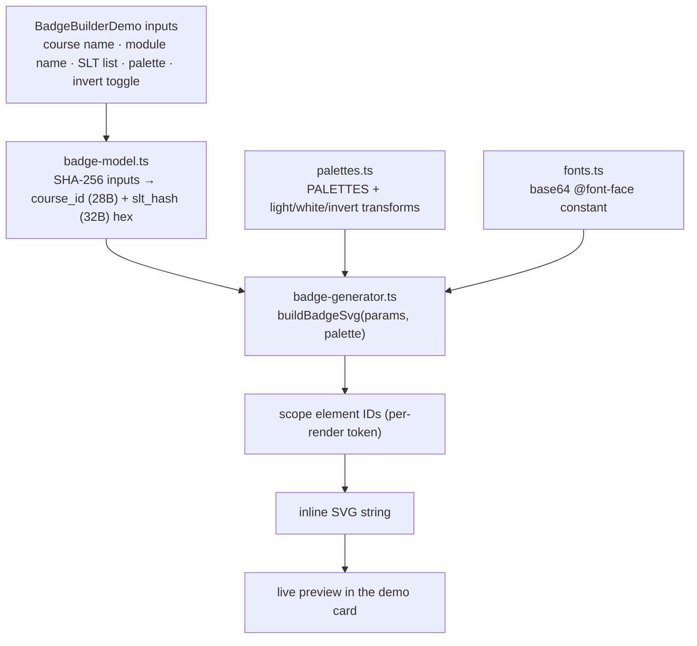
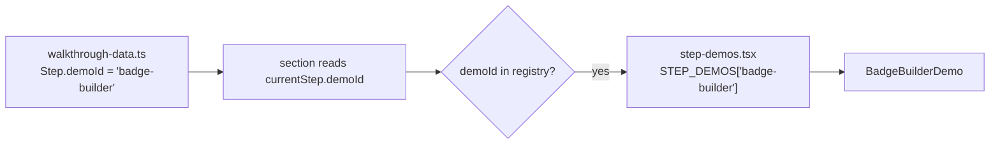

# feat: Badge-builder demo — live in-browser Proof Rings generator on the landing page

**Repo:** `landing-page-and-blog` (this repo) · **Branch:** `feat/enterprise-landing-page`. All file paths are repo-relative to `landing-page-and-blog`.

---

## Summary

Add an interactive "build a badge" demo to the V2 landing walkthrough: a visitor types a course name, a module name, and a list of SLTs, picks a color palette, and toggles light/dark interior — and watches a real Andamio "Proof Rings" credential badge render live in the browser. It drops into the existing `STEP_DEMOS` seam (shipped by the mini-demos plan) as the next demo, and is the strongest possible "Try it yourself" — the visitor operates the credential design instead of reading about it.

The one genuinely new piece is a **client-side TypeScript port of the Python Proof Rings generator** (`credential-badges` repo's `generator/gen.py` + `colors.py`). Everything else is the established walkthrough-demo pattern.

---

## Problem Frame

The landing page shows a *static* hero badge (`public/andamio-credential-badge.svg`) — a beautiful but inert image. The badges themselves are now live and deployed at `credentials.andamio.io` (tagged `v0.1.2`), and the design is locked. The missing rung on the explorer's CTA ladder is a hands-on moment: a visitor who *builds* a badge — sees their typed inputs become the ring encoding, picks colors, flips the interior — understands what an Andamio credential is in a way no prose or static image achieves. This is a stronger "Try it yourself" than linking out to `app.andamio.io`.

The generator that produces every deployed badge is pure, deterministic Python string-assembly (no server logic, no secrets) — which makes a client-side port the natural render path: instant, no infra, exact design reuse, and the rings react live as the visitor types.

---

## Requirements

**Builder inputs and rendering**
- R1. The visitor can enter a course name, a module name, and a list of SLTs (add / edit / remove rows), and the badge re-renders live as inputs change.
- R2. The rendered badge is the real Proof Rings design — two encoded rings (outer / inner), titles as the heroes, hashes printed small, "ANDAMIO" maker's mark, OB3 metadata baked into the SVG — visually matching the deployed badges for the same inputs.
- R3. The typed inputs deterministically drive the ring encoding (the core teaching moment): the same inputs always produce the same rings, and the rings are decodable back to the encoded values.

**Controls**
- R4. The visitor can choose a color palette from the generator's palette set.
- R5. The visitor can toggle the interior style — light interior / colored band (canonical) vs. white band / colored interior (inverted) — using the `invert_colors` recipe from the experiment.

**Integration and framing**
- R6. The demo mounts inside the walkthrough via the existing `demoId` / `STEP_DEMOS` seam — data + one component + one registry line, no change to the section's render seam.
- R7. The badge is clearly framed as an illustrative preview, not a real issued credential: no signed `verify=` claim, and copy that names it a preview. No wallet, no mainnet, no network.
- R8. Respects `prefers-reduced-motion`, works on mobile, adds no new runtime dependencies, and passes `tsc --noEmit` + `next lint` + `next build`.
- R9. The `badge/` generator core (generator, palettes, fonts, model) is **framework-free and zero-coupled to this repo** — no React, Next, shadcn, or landing imports — with a clean public API, so andamio-app-v2 (and credential-badges) can reuse it to render the same badges from real on-chain data by copying or extracting the folder unchanged. Only `BadgeBuilderDemo.tsx` is landing-specific.

---

## Key Technical Decisions

- KTD-1 — **Client-side TypeScript port of the generator (render path).** Translate `gen.py` + `colors.py` into a pure, framework-free TS module that builds the SVG string in the browser. The generator is deterministic string assembly + trig with no server-side logic, so a port gives instant live rendering, zero infra, and exact design reuse. (Decided with James; alternatives — serverless render, parameterized SVG template — rejected: see Alternatives.)
- KTD-2 — **Port into this repo now, extraction-ready; shared package is follow-up.** The TS module lives in `landing-page-and-blog` under the V2 landing tree, but the `badge/` core is built to a hard reuse boundary (R9): it imports nothing from React, Next, shadcn, `_ui.tsx`, or anywhere else in this repo — only standard browser APIs (Web Crypto) and its own files. A consumer (andamio-app-v2's holder view, `credential-badges`) reuses it by copying or extracting the folder verbatim and calling `buildBadgeSvg`. A published `@andamio/badge` package is the eventual home but is deferred — it needs a publishing pipeline and cross-repo version contract this demo doesn't justify yet. Designing to the boundary now makes that extraction mechanical (this is the app-reuse decision James confirmed: extraction-ready, not packaged-now).
- KTD-3 — **Typed inputs are hashed into the rings (SHA-256), framed as a preview.** Real badges encode on-chain `course_id` (28 bytes) and `slt_hash` (32 bytes). The visitor types names, not hashes — so the demo SHA-256s the inputs to synthesize those values: the course name → a 28-byte outer-ring value, the list of SLTs (canonicalized) → a 32-byte inner-ring value. This preserves R3's determinism and the "your inputs become the rings" lesson honestly, because the badge is explicitly a preview (KTD / R7), not a falsifiable on-chain record. Web Crypto `crypto.subtle.digest` is built-in (no dependency); rendering happens in an async effect.
- KTD-4 — **Embed the badge's own fonts.** The badge uses Archivo + Spline Sans Mono; the site uses Inter / Sora / JetBrains Mono. The SVG must carry its own `@font-face` block, so copy the generator's base64-embedded `fonts.css` (~55 KB) into a TS constant and inline it in the generated SVG. This keeps the preview self-contained and pixel-faithful without touching the site's font loading.
- KTD-5 — **Scope SVG element IDs per badge instance.** The generated SVG references `url(#field)`, `url(#core)`, `url(#glow)`. Multiple inline SVGs on one page (or live re-renders) collide on these IDs. Suffix every internal `id=` and its `url(#…)` / `xlink:href` references with a per-render unique token so inlined badges never cross-talk (same lesson as the badge gallery's `prep_svg`).
- KTD-6 — **Verification without a test harness; the port gets a parity/round-trip check.** Per the repo's established posture (mini-demos KTD-5: no test runner, no new deps), UI units are verified via `tsc --noEmit` + `next lint` + `next build` + visual checks (Playwright available at the environment level for screenshots). The pure generator port is the exception worth a real check: a small dev-only Node script renders known inputs through the TS port and asserts the ring geometry decodes back to the input hex (mirroring `credential-badges` `decode.py`), and spot-compares output against the Python generator for the same inputs. Adding a full runner is deferred.
- KTD-7 — **Post-de-slop design idiom.** Build the demo card in the current V2 idiom: `rounded-lg`, soft shadow, the shared primitives in `src/ui/landing/V2Landing/_ui.tsx` (`Kicker`, button classes), no offset shadows. `font-mono` only for the on-chain-style data fields (the printed hashes), never labels. Reduced motion via `useReducedMotion()`, mirroring the hero.

---

## High-Level Technical Design

**Data flow — typed inputs to live SVG, all in the browser:**



**Integration — the demo drops into the shipped seam (no edit to the render seam):**



Directional only; the per-unit fields below are authoritative.

---

## Output Structure

New badge module (self-contained, extraction-ready per KTD-2):

```
src/ui/landing/V2Landing/
  badge/
    badge-generator.ts     # pure SVG builder (port of gen.py)
    palettes.ts            # PALETTES + light/white/invert transforms (port of colors.py)
    fonts.ts               # base64 @font-face constant (from generator/fonts.css)
    badge-model.ts         # typed inputs → SHA-256 → ring hex params (KTD-3)
  BadgeBuilderDemo.tsx     # the interactive demo card
scripts/
  badge-parity-check.mjs   # dev-only round-trip/parity check (KTD-6)
```

`step-demos.tsx` and `walkthrough-data.ts` are edited, not created.

---

## Implementation Units

### U1. Port the Proof Rings generator to a pure TS module

**Goal:** A framework-free TS module that builds the exact Proof Rings SVG from a params object + palette, with scoped IDs and embedded fonts.
**Requirements:** R2, R3, R5, KTD-1, KTD-4, KTD-5.
**Dependencies:** none.
**Files:**
- `src/ui/landing/V2Landing/badge/badge-generator.ts` (new)
- `src/ui/landing/V2Landing/badge/palettes.ts` (new)
- `src/ui/landing/V2Landing/badge/fonts.ts` (new)

**Approach:** Port `gen.py` helpers to TS: `ringTicks(R, hex, color, hair)` (byte→bit→tick trig; byte 0 at −90°, clockwise, MSB-first; `parseInt(slice,16)`, `Math.cos/sin`, `.toFixed(2)`), `fitTitle`, `wrap2`, `layTitle`, `esc`, `credentialJson` (OB3 metadata via `JSON.stringify(…, null, 2)`), `fillDefaults`, and `buildBadgeSvg(params, palette)` assembling defs (gradients `field`/`core`, filter `glow`), rings, centered title block, divider, maker's mark. Port `palettes.ts`: the 10-entry `PALETTES` array (all 20 token keys), `_mix`, `lightInterior`, `whiteInterior`, and `invertColors` (from `attachments/badge-design/invert-experiment/` in the orchestration area — white band / colored interior). `fonts.ts` exports the base64 `@font-face` block copied from `credential-badges` `generator/fonts.css`; `buildBadgeSvg` inlines it. Add ID scoping (KTD-5): accept or generate a per-render token and suffix every internal `id=`/`url(#…)`/`xlink:href`.
**Patterns to follow:** `credential-badges` `generator/gen.py`, `colors.py` (the source of truth — match structure and numbers); the gallery's `prep_svg` ID-namespacing approach for KTD-5.
**Test scenarios** (verification cases per KTD-6; exercised by `scripts/badge-parity-check.mjs`):
- Covers R3. Given a known 28-byte course hex + 32-byte slt hex, `buildBadgeSvg` output's ring ticks decode back to the same hex (port of `decode.py` round-trip) — outer == course hex, inner == slt hex.
- Covers R2. Output for a fixed (inputs, palette, interior) triple is byte-stable across runs (deterministic) and structurally matches the Python generator's SVG for the same inputs (spot-compare defs + tick counts).
- Two badges rendered with different per-render tokens have no overlapping internal IDs (KTD-5).
- Covers R9. The `badge/` core files import nothing from React, Next, shadcn, `_ui.tsx`, or elsewhere in this repo (grep the import lines; only intra-`badge/` and standard browser APIs allowed) — proving the folder is copy/extract-ready for app-v2.
- `invertColors` overrides exactly the band + interior tokens it should; `lightInterior` matches the canonical deployed look.
- Long titles wrap to 2 lines and shrink to fit (`layTitle` parity with `lay_title`).
**Verification:** `scripts/badge-parity-check.mjs` passes (round-trip + determinism); `tsc --noEmit` clean.

### U2. Typed-input → badge-params model

**Goal:** Map the visitor's text inputs to the generator's params, hashing names into ring hex and carrying the preview framing.
**Requirements:** R1, R3, R7, KTD-3.
**Dependencies:** U1 (consumes the params shape).
**Files:**
- `src/ui/landing/V2Landing/badge/badge-model.ts` (new)

**Approach:** Export `buildBadgeParams({ courseName, moduleName, slts })` returning `{ courseTitle, moduleTitle, courseIdHex, sltHashHex, network: "preview" }`. Use Web Crypto `crypto.subtle.digest("SHA-256", …)` on the course name → take 28 bytes → hex (outer ring); canonicalize the SLT list (trim, drop empties, join with a stable separator) → SHA-256 → 32 bytes → hex (inner ring). Async (returns a promise). Build `credentialJson` with no `verify=` value and a `preview` marker so the OB3 block reads honestly (R7). Define the `BadgeInputs` type used by the component.
**Patterns to follow:** the on-chain triple shape in `credential-badges` `generator/build.py` (`course_id`, `slt_hash`, titles); KTD-3 framing.
**Test scenarios** (per KTD-6):
- Covers R3. Same inputs → same hex (deterministic); changing one SLT changes `sltHashHex` and leaves `courseIdHex` unchanged.
- `courseIdHex` is exactly 56 hex chars (28 bytes); `sltHashHex` is 64 (32 bytes).
- Empty / whitespace-only SLT rows are dropped before hashing; an empty list still produces a valid (all-empty-canonical) hash without throwing.
- The generated OB3 metadata carries no signed `verify=` claim (R7).
**Verification:** covered by `scripts/badge-parity-check.mjs`; `tsc --noEmit` clean.

### U3. `BadgeBuilderDemo` component

**Goal:** The interactive card — inputs + palette picker + interior toggle on one side, live badge preview on the other.
**Requirements:** R1, R4, R5, R7, R8, KTD-7.
**Dependencies:** U1, U2.
**Files:**
- `src/ui/landing/V2Landing/BadgeBuilderDemo.tsx` (new)

**Approach:** `"use client"` component. Controlled inputs (shadcn `Input`) for course name + module name; an add/edit/remove SLT row list; a palette picker (shadcn `Select` or a swatch row over `PALETTES`); a light/dark interior toggle (shadcn checkbox/switch). On any change, debounce, call `buildBadgeParams` (async) then `buildBadgeSvg` with the chosen palette + interior transform + a fresh per-render ID token, and inject the SVG via `dangerouslySetInnerHTML` (the SVG is generated by our own code from sanitized/escaped inputs — `esc` handles text nodes). Layout + styling per KTD-7 (`_ui.tsx` primitives, `rounded-lg`, soft shadow, `font-mono` only on the printed hash fields). Reduced motion via `useReducedMotion()`. A short caption frames it as an illustrative preview (R7). Mobile: stack controls above preview.
**Patterns to follow:** the shipped `V2VerifierDemo` (mini-demos plan U2) for card structure, reduced-motion, and on-brand idiom; `src/components/ui/input.tsx`, `button.tsx`, `_ui.tsx`.
**Test scenarios** (per KTD-6 — `tsc`/`lint`/`build` + visual):
- Covers R1. Typing a course/module name and editing SLT rows re-renders the preview live; add/remove SLT rows works.
- Covers R4/R5. Switching palette and flipping the interior toggle update the preview without remounting; the toggle visibly swaps band/interior.
- Covers R8. With `prefers-reduced-motion`, any transition is skipped; mobile layout stacks cleanly at a narrow viewport (Playwright screenshot).
- Rapid typing debounces (no jank); an in-flight async hash never paints a stale badge over a newer one.
**Verification:** `tsc --noEmit` + `next lint` + `next build` clean; visual check at desktop + mobile widths.

### U4. Mount the demo via the `demoId` / `STEP_DEMOS` seam

**Goal:** Register `badge-builder` and attach it to the right walkthrough step — data + one registry line, no render-seam change (R6).
**Requirements:** R6.
**Dependencies:** U3.
**Files:**
- `src/ui/landing/V2Landing/step-demos.tsx` (edit)
- `src/ui/landing/V2Landing/walkthrough-data.ts` (edit)

**Approach:** Add `"badge-builder": BadgeBuilderDemo` to the `STEP_DEMOS` registry. In `walkthrough-data.ts`, set `demoId: "badge-builder"` on the step whose claim is about designing / issuing a credential (read the file to pick the step — likely a cert or platform archetype step that currently says "design your credential / issue"). No JSX in the data file; no edit to the section's generic render seam.
**Patterns to follow:** mini-demos plan U1 + KTD-1 (the seam contract).
**Test scenarios** (per KTD-6):
- Covers R6. Selecting that archetype and navigating to the chosen step renders the badge builder; no other step renders it; `demoId` is the only data change.
- The section's render seam (`STEP_DEMOS[demoId]`) is untouched (diff shows only a registry entry + one data field).
**Verification:** visual walkthrough of the step; `tsc`/`lint`/`build` clean.

---

## Scope Boundaries

**In scope:** the live in-browser builder (inputs, palette, interior toggle), the TS generator port, and mounting it in the walkthrough. Illustrative preview only.

### Deferred to Follow-Up Work
- **Shared `@andamio/badge` package** consumed by both this repo and `credential-badges` (KTD-2) — needs a publishing pipeline + cross-repo contract.
- **"Download your badge" / share link** — a natural capstone, but the render-live experience is the demo; download can follow.
- **Real on-chain reads** (pull actual `course_id`/`slt_hash` from `andamioscan` / the gateway) — the demo is intentionally hash-from-text; real reads are a fidelity upgrade.
- **Automated test runner** — the repo has none; deferred per KTD-6.

### Outside this demo's identity
- Wallet connection, mainnet, real credential issuance, the `verify=` signing path. The demo never touches these (R7).

---

## Risks & Dependencies

- **Font payload.** Inlining the ~55 KB base64 font block per badge is fine for one live preview, but re-injecting the full SVG on every keystroke could feel heavy; the debounce (U3) plus a single mounted preview keeps it cheap. If profiling shows jank, hoist the `<style>`/font block out of the per-render string.
- **Async render ordering.** SHA-256 via Web Crypto is async; a naive effect can paint a stale badge. U3 must guard against out-of-order resolution (latest-wins).
- **Generator drift.** The TS port duplicates `gen.py`/`colors.py`; if the locked design changes, both must move. KTD-6's parity check is the guard, and KTD-2's extraction-ready structure is the long-term fix.
- **Dependency:** the port mirrors `credential-badges` `generator/` (gen.py, colors.py, fonts.css, decode.py) — the source of truth for numbers and the round-trip check.

---

## Alternatives Considered

- **Serverless render endpoint** (keep Python, call it for each SVG). Rejected: adds infra + per-keystroke network latency + a deploy surface for logic that has no server-side secret. The generator is pure — there's nothing a server adds.
- **Parameterized SVG template** (ship one baked SVG, swap text/colors client-side). Rejected: it cannot regenerate the rings (tick geometry derives from the hashed inputs), so it loses the core "your inputs become the rings" teaching moment — a mockup, not a builder.

---

## Sources / Research

- `credential-badges` `generator/gen.py`, `colors.py`, `decode.py`, `fonts.css`, `build.py` — the generator being ported; source of truth for geometry, palettes, and the round-trip check.
- `attachments/badge-design/invert-experiment/` (Andamio orchestration area) — the `invert_colors` recipe for R5/KTD-1.
- `docs/plans/2026-06-18-001-feat-landing-walkthrough-mini-demos-plan.md` (this repo, `completed`) — the `demoId` / `STEP_DEMOS` seam, the post-de-slop idiom (KTD-7), and the no-test-runner posture (KTD-6) this plan builds on.
- `src/ui/landing/V2Landing/V2IssuerExplorer.tsx`, `_ui.tsx`, `V2HeroSection.tsx`, `public/andamio-credential-badge.svg`; `src/components/ui/input.tsx`, `button.tsx` — landing conventions and the static hero badge.
- Deployed badges: `credentials.andamio.io/badges/<course_id>.<slt_hash>.svg` (tagged `v0.1.2`) — the visual target.
