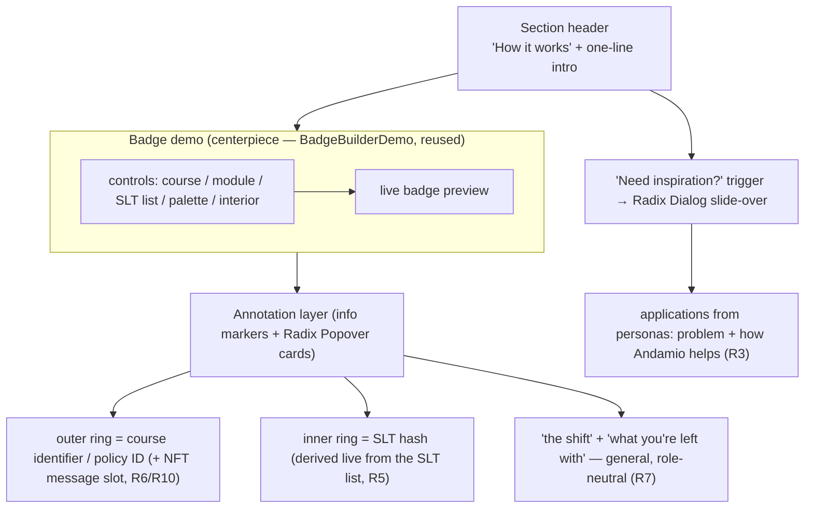

# feat: How it works — single general-purpose annotated badge demo

**Repo:** `landing-page-and-blog` · **Branch:** `feat/enterprise-landing-page`. All paths repo-relative.

---

## Summary

Rebuild the "How it works" section (`V2IssuerExplorer`) from a buyer-segmented, pick-an-archetype walkthrough into **one general-purpose, annotated, "show don't tell" badge demo**. The badge builder (shipped this session) becomes the centerpiece. The archetype/persona content moves into a **"Need Inspiration" drawer**; the "shift" and "what you're left with" messaging becomes **info-icon cards** placed on the demo; and the badge itself is **annotated** to teach what the two rings mean — including the Andamio-moat point that a unique course-identifier ring only comes from the on-chain course NFT.

## Problem Frame

The current section (built from `origin`) segments visitors into three archetypes and walks each through four steps. It tells. The badge builder we just shipped lets us *show*: a visitor builds a credential and sees its rings derive from their inputs. That interaction is a stronger explanation of what's unique about Andamio than any prose walkthrough, and it doesn't need to be gated behind a buyer archetype — the demo is general-purpose. The archetype content is still valuable, but as *inspiration* ("here's how a cohort / cert body / platform might use this"), not as the primary axis. This evolves the unified-explorer requirements: same section, same voice and guardrails, but the picker gives way to the demo (see origin: `docs/brainstorms/2026-06-22-unified-issuer-explorer-requirements.md`).

---

## Requirements

**Structure**
- R1. The section presents **one general-purpose badge demo** as its centerpiece — no archetype selector cards, no per-archetype step tabs as the primary flow.
- R2. The badge builder renders directly in the section (not gated behind a step/archetype), with the controls + live preview balance tuned this session preserved.

**Inspiration drawer**
- R3. A **"Need Inspiration" drawer** (side/slide-over) lists applications drawn from the three personas, each as *problem statement + how Andamio helps*. It is opt-in (a trigger), not always-open, so it never competes with the demo.

**Annotation & messaging**
- R4. The badge is **annotated**: info markers identify the **outer ring = course identifier (policy ID)** and the **inner ring = SLT hash**, via hover/click cards.
- R5. The demo **surfaces the SLT hash being derived** — it visibly ties the typed SLT list to the inner ring (the builder already SHA-256s the SLTs; make that legible).
- R6. An annotation carries the moat message: the SLT hash is **derivable by anyone, free and deterministic**, but a **unique course-identifier ring only comes from the on-chain course NFT**. The exact "two ways to get the NFT" wording is an Open Question (R10); build the slot, do not assert an unverified claim.
- R7. The **"shift"** and **"what you're left with"** messaging (old steps 02 / 04) survives as **info-icon cards** on the demo, written generically across the three roles (no buyer-specific framing on the card faces).

**Copy & guardrails**
- R8. All new/repurposed copy follows the established voice (simple sentences, no em-dashes, no periods on headings, no orange eyebrows, Sora display, comma before "and", no sentence-initial "And").
- R9. The **no-cross-issuer-composability guardrail** holds: gating claims stay **within your own pathways/platform**; cross-org value is framed only as portability ("anyone can verify it"), never automatic cross-org enforcement (see origin; ee#54 gate).

---

## Key Technical Decisions

- KTD-1 — **General-purpose, demo-first; archetypes demote to inspiration.** Remove the `Key` archetype state and the step tabs/slides as the primary view. The section becomes: headline + intro, the badge demo, annotation cards, and a "Need Inspiration" trigger. This is a deliberate evolution of the origin's pick-to-reveal model (R1); the origin's archetype *content* is preserved, repurposed (R3), not deleted.
- KTD-2 — **Reuse the badge demo and core unchanged.** `BadgeBuilderDemo` + the `badge/` module are the centerpiece as-is; this work wraps annotation + context around them, and changes only how the demo *mounts* (directly, not via the `demo` step flag). Keeps the reusable core untouched.
- KTD-3 — **Annotations = absolutely-positioned info markers + Radix Popover cards.** Place small info markers around the badge container (pointing at outer/inner ring) and inline in the demo; clicking/hovering opens a Radix Popover (already a dependency — no new deps). Reduced-motion aware, keyboard-operable. Card content is general across roles (R7).
- KTD-4 — **Drawer = Radix Dialog styled as a slide-over.** `@radix-ui/react-dialog` is already a dependency; render it as a right-side sheet. Triggered by a "Need inspiration?" affordance near the demo (R3). No new dependency.
- KTD-5 — **SLT-hash derivation made legible.** Surface the existing hash (`buildBadgeParams` already produces the inner-ring hex from the SLT list) as a visible annotation — e.g., an inline "your learning targets → SHA-256 → this ring" cue tied to the inner-ring marker (R5). No change to the hashing itself.
- KTD-6 — **NFT course-ring message via an open-copy slot.** The annotation states the conceptual point (derivable SLT hash vs. NFT-gated course ring) but the precise "two ways" sentence is a fill-in resolved by James (R10), kept within the composability guardrail (R9). The demo's course ring stays a clearly-labeled preview (hashed from the typed name), consistent with the badge demo's existing "illustrative preview" framing.
- KTD-7 — **Verification without a test runner.** Per the repo posture (`tsc --noEmit` + `next lint` + `next build` + visual; Playwright for screenshots). No new runtime dependencies.

---

## High-Level Technical Design

**New section anatomy** — the demo is the spine; archetypes and step-messaging become optional, on-demand layers around it:

**Interaction:** the section is never empty (the demo is always present, no archetype to pick first). Info markers and the inspiration drawer are opt-in reveals — depth on demand, the origin's philosophy, now centered on the demo instead of a picker. Directional; per-unit fields are authoritative.

---

## Implementation Units

### U1. Restructure the section into a general-purpose demo

**Goal:** Strip the archetype selector + step-tab/slide flow; make the badge demo the always-present centerpiece under the header.
**Requirements:** R1, R2, KTD-1, KTD-2.
**Dependencies:** none.
**Files:**
- `src/ui/landing/V2Landing/V2IssuerExplorer.tsx` (modify)
**Approach:** Remove the `Key`/`step` state, the three archetype `<button>` cards, and the progress-tab + slide grid as the primary view. Keep the section shell (`id`, header "How it works" + intro). Render `BadgeBuilderDemo` directly as the centerpiece. The per-archetype data (currently inline `ARCHETYPES`) is retained for U2/U3 to consume — extract it to a small data module if that reads cleaner (build-time call). Drop the cohort-step `demo` flag wiring from the prior plan (the builder no longer mounts through a step).
**Patterns to follow:** the section shell + `_ui.tsx` primitives already in `V2IssuerExplorer`; the de-slop idiom.
**Test scenarios** (per KTD-7):
- Covers R1. The rendered section shows no archetype selector cards and no numbered step tabs; the badge demo is visible without any prior click.
- Covers R2. The demo's controls + preview render at the tuned widths (card `max-w-6xl`, `1fr/2fr`).
- `tsc --noEmit` clean after removing the now-unused archetype/step state and types.
**Verification:** section renders demo-first; no dead references to removed state; visual check desktop + mobile.

### U2. "Need Inspiration" drawer

**Goal:** A slide-over listing applications (problem + how Andamio helps) drawn from the three personas, opt-in via a trigger.
**Requirements:** R3, R8, R9.
**Dependencies:** U1.
**Files:**
- `src/ui/landing/V2Landing/V2IssuerExplorer.tsx` (modify — trigger + drawer mount)
- `src/ui/landing/V2Landing/inspiration-data.ts` (new — applications copy, derived from the archetype "problem" content + personas)
**Approach:** Build a right-side drawer with `@radix-ui/react-dialog` (KTD-4). A "Need inspiration?" affordance near the demo opens it. Content: one entry per application (seeded from Theo / Carmen / Marcus and the existing archetype Step-01 "problem" + points), each as a short *problem statement + how Andamio helps* pair, role-neutral in tone, within the composability guardrail (R9) and voice rules (R8). Keyboard + focus-trap come from Radix; respect reduced motion on the slide transition.
**Patterns to follow:** existing Radix usage in the repo; `_ui.tsx` button classes; persona language from `andamio-circles/product-circle/personas/ei-buyer-personas.md` (per origin) — paraphrased to the landing voice, not copied verbatim.
**Test scenarios** (per KTD-7):
- Covers R3. The trigger opens the drawer; the drawer lists the applications; Esc / overlay-click / close button dismiss it; focus returns to the trigger.
- Covers R8/R9. Copy carries no em-dashes, no heading periods, no buyer-sales framing, and no cross-org automatic-enforcement claim (gating stays within-pathway; cross-org = portability only).
- Reduced motion: the slide transition is skipped/instant.
- Mobile: the drawer is usable at a narrow viewport (full-width or near-full sheet).
**Verification:** drawer opens/closes accessibly; copy passes the voice + guardrail read; `tsc`/`lint`/`build` clean.

### U3. Badge annotation layer (info markers + Popover cards)

**Goal:** Annotate the demo — identify each ring, surface the SLT-hash derivation, carry the NFT-course-ring message, and fold in the "shift" / "what you're left with" messaging.
**Requirements:** R4, R5, R6, R7, R8, R9.
**Dependencies:** U1.
**Files:**
- `src/ui/landing/V2Landing/V2IssuerExplorer.tsx` (modify — annotation markers around the demo)
- `src/ui/landing/V2Landing/BadgeBuilderDemo.tsx` (modify — expose anchor points / a slot for ring markers if needed)
- `src/ui/landing/V2Landing/annotation-data.ts` (new — card copy: ring explanations, SLT-derivation cue, NFT message slot, shift/left-with)
**Approach:** Place small, accessible info markers near the badge (outer-ring marker, inner-ring marker) and inline in the demo for the "shift"/"left with" messaging (KTD-3). Each opens a Radix Popover. Card content (KTD-5/6):
- **Outer ring** — "Course identifier (policy ID)." Carries the moat message + the R10 open-copy slot for the NFT "two ways."
- **Inner ring** — "SLT hash." Shows it derived: typed learning targets → SHA-256 → this ring (R5), reusing the value the builder already computes.
- **Shift / What you're left with** — the old step 02/04 messaging, rewritten general across roles (R7).
Keyboard-operable, reduced-motion aware. Course ring stays labeled a preview (KTD-6).
**Patterns to follow:** Radix Popover; `font-mono` only on hash/id values (the established rule); the badge demo's existing "illustrative preview" caption.
**Test scenarios** (per KTD-7):
- Covers R4. Outer/inner ring markers each open a card naming the ring correctly (policy ID / SLT hash).
- Covers R5. Editing an SLT updates the inner-ring value shown in its card (derivation is live, not static).
- Covers R6/R9. The course-ring card states the derivable-vs-NFT distinction without a cross-org enforcement claim; the "two ways" copy is a clearly-marked slot, not a fabricated specific claim.
- Covers R7/R8. The shift / left-with cards read role-neutral and pass the voice rules.
- Reduced motion + keyboard: markers are focusable, open on Enter/Space, close on Esc; no motion when reduced.
**Verification:** every marker opens the right card; inner-ring value tracks edits live; copy passes voice + guardrail; `tsc`/`lint`/`build` clean.

### U4. Copy, CTA ladder, and integration pass

**Goal:** Final copy rewrite to voice, adapt the CTA ladder to the demo-first section, and verify the whole section reads as one designed piece.
**Requirements:** R8, R9.
**Dependencies:** U1, U2, U3.
**Files:**
- `src/ui/landing/V2Landing/V2IssuerExplorer.tsx` (modify — header/intro copy, CTA placement)
**Approach:** Rewrite the header/intro for the general-purpose framing (no buyer segmentation). Reconcile the CTA ladder with the origin's philosophy (explore/hands-on → email-report placeholder → book) now that the demo *is* the hands-on step: the inline "Try it yourself" external link is redundant beside the live builder, so resolve that (drop or repoint it) and keep the "Book a walkthrough" conversion at the section's end. Final voice + guardrail sweep over all new copy. No time/calendar framing (origin non-goal).
**Patterns to follow:** origin CTA ladder section; landing voice rules; `_ui.tsx`.
**Test scenarios** (per KTD-7):
- Covers R8. Header, intro, and CTA copy pass the voice rules (no em-dashes, no heading periods, no orange eyebrows, simple sentences).
- The redundant "Try it yourself" external link is resolved (not sitting beside the live builder doing the same job).
- No step/section copy references a timeline or month (origin non-goal).
- Reads as one designed section (visual pass, desktop + mobile).
**Verification:** full-section visual review; `tsc`/`lint`/`build` clean.

---

## Scope Boundaries

**In scope:** the `V2IssuerExplorer` redesign — demo-first restructure, inspiration drawer, annotation layer, copy/voice/guardrail pass.

### Deferred to Follow-Up Work
- **Exact NFT "two ways" annotation copy** (R10) — resolved by James, then dropped into the U3 slot.
- **Real on-chain reads** for the course ring (showing an actual minted policy ID vs. the preview hash) — the demo stays preview-only.
- **"Get the report" email capture** — remains the disabled placeholder per origin.

### Outside this redesign (origin non-goals)
- No changes to other sections (hero, problem, Issuer overview, Andamio API, footer).
- No new archetypes/personas beyond the existing three.
- No time-based or calendar framing anywhere.

---

## Open Questions

- R10. **The "two ways" to get the course NFT.** James to specify the exact wording for the outer-ring annotation (R6). Until then U3 ships the slot with placeholder copy that states only the verified conceptual point (derivable SLT hash vs. NFT-gated course identity), within the composability guardrail. Do not invent a specific on-chain mechanism on the public page.

---

## Risks & Dependencies

- **Annotating a circular SVG badge** — positioning ring markers precisely against a responsive, CSS-scaled SVG is fiddly. Mitigate by anchoring markers to the demo container (not SVG internals) and pointing with labels rather than pixel-perfect callout lines; the badge's `idSuffix`-scoped ids mean multiple instances stay safe.
- **Voice + guardrail drift** — the most likely review finding is copy slipping into buyer-sales framing, a heading period, or an implied cross-org enforcement claim. R8/R9 test scenarios guard each unit; a final sweep in U4.
- **Origin tension** — this removes the archetype picker the origin established. Confirmed superseded by James's newer direction; the origin's still-binding parts (voice, guardrail, personas, CTA philosophy, non-goals) are carried forward explicitly.
- **Dependency:** Radix Dialog + Popover (already in the dependency set — no new deps); the reusable `badge/` module + `BadgeBuilderDemo` (this branch).

---

## Sources / Research

- `docs/brainstorms/2026-06-22-unified-issuer-explorer-requirements.md` (origin) — voice rules, persona mapping, the no-cross-issuer-composability guardrail, CTA ladder philosophy, non-goals.
- Spec note "Why prioritize Badges?" (Andamio orchestration vault) — the demo-first direction; screenshot `attachments/badge-design/how-it-works-current-20260623.png` (orch vault).
- `docs/plans/2026-06-23-001-feat-badge-builder-demo-plan.md` — the badge builder + reusable `badge/` core this section centers on.
- `src/ui/landing/V2Landing/V2IssuerExplorer.tsx`, `BadgeBuilderDemo.tsx`, `badge/`, `_ui.tsx` — current code.
- `andamio-circles/product-circle/personas/ei-buyer-personas.md` (per origin) — persona pain/job/payoff for the inspiration drawer copy.
